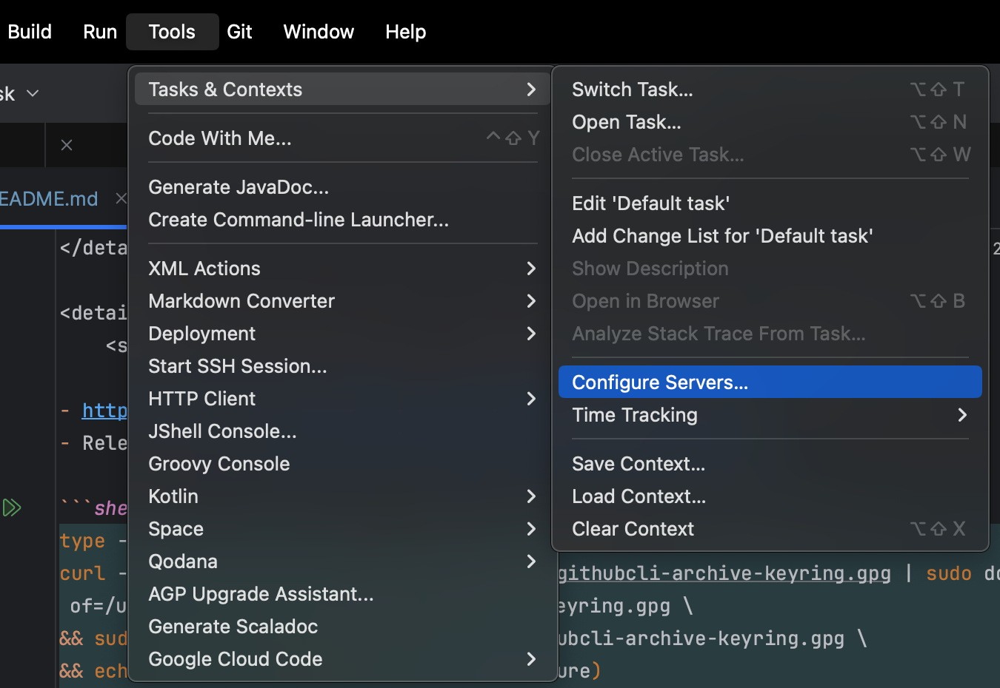
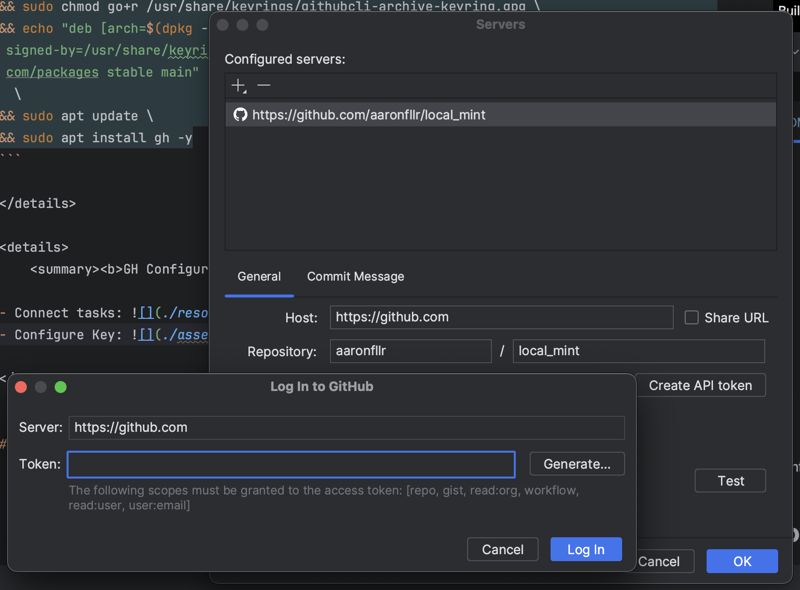

# Hacker's Kotlin Local on Mint

Version: dm: LightDM Distro: Linux Mint 21.2 Victoria base: Ubuntu 22.04 jammy

> This serves as an exposé and example of the
> typical [competent local](https://github.com/readme/guides/developer-onboarding "Optimize local dev environments for better onboarding")
> setup for [the modern 12-factor-app](https://12factor.net/ "The Twelve-Factor App") development workflow within [*
*fluent-development-style**](https://martinfowler.com/articles/agileFluency.html "Fluent Development Style")
> of [Extreme Programming (XP).](https://en.wikipedia.org/wiki/Extreme_programming "Extreme Programming") _This is how the
world's most competent and performant software engineers, "hackers," work to disrupt markets, generate value and profit,
and make the world a better place._ - and so can you!

## Basic Principles

1. _There's only production, and your local is part of
   it, **treat it as such**:_ [Factor X](https://12factor.net/dev-prod-parity "Factor X of The Twelve-Factor App")
2. _Only absolutely common packages and configurations are global configurations._
3. **_The world is multifaceted, and so Linux is multiuser._**

## The Global Setup Journey

<details>
  <summary><b>OS Setup - <i>Everything begins with the local...</i></b></summary>

1. Install your OS: [Linux Mint](https://linuxmint.com/download.php "Linux Mint"), a [Mate Desktop Environment](https://www.linuxmint.com/rel_vanessa_mate_whatsnew.php "Mate DE packaging distribution") in our
   case, but you are free to choose any or many available - [beginner's guide](https://itsfoss.com/install-linux-mint/).
2. **Concept:** _Your first user is **reserved** for you and is the only user with `sudo` access. If you have multiple
   customers or entities to code for separate them by creating additional accounts, leaving the first one untarnished.
   If you have separate boxes for separate gigs like we do the one user may suffice for you, yet a separate single user
   for coding is best recommended._
3. Upgrade base packages: [step 01 - the base](step-01-base.md)
4. Configure your shell: [step 02 - the 'oh your shell'](step-02-shell.md)
5. Useful Global Apps!: [step 03 - global apps](step-03-global-apps.md)

</details>

---

*_From this point, each local-user development toolset is configured "as a user," including if only one user opted to be
used._** _The actual development environment is encapsulated by a Linux user._

## Dev User Keys Setup

This sequence applies to each local development user.

### Configure Git

- Copy your public GitHub email address: https://github.com/settings/keys
- Follow these instructions to configure Git: https://git-scm.com/book/en/v2/Getting-Started-First-Time-Git-Setup

<details>
  <summary><b>Instructions</b> - <i>Git Client, initial setup</i></summary>

```shell
git config --global user.name "yer-github-handle"
git config --global user.email "12781006+yer-handle@users.noreply.github.com"
git config --list --show-origin
```

</details>

### SSH Key - Authentication

- GitHub over ssh: https://docs.github.com/en/authentication/connecting-to-github-with-ssh

<details>
  <summary><b>Instructions</b> - <i>SSH Key</i></summary>

```shell
# Okay to accept all defaults
ssh-keygen -t ed25519
```

- Copy public key into clipboard:

```shell
sudo apt install xclip
cat ~/.ssh/id_ed25519.pub | xclip -i -sel clip
```

- Navigate to your account keystore: https://github.com/settings/keys
- Paste public key from clipboard into the `Key` field,
    - leave `Key type` as "Authentication Key"
    - provide no `Title`
    - press `Add SSH Key`

</details>

### GPG keys - Signing

- [Generating a new GPG key](https://docs.github.com/en/authentication/managing-commit-signature-verification/generating-a-new-gpg-key?platform=linux "If you don't have an existing GPG key, you can generate a new GPG key to use for signing commits and tags.")
- [Adding a GPG key to your GitHub account](https://docs.github.com/en/authentication/managing-commit-signature-verification/adding-a-gpg-key-to-your-github-account "Add a GPG key to your GitHub account.")
- [Telling Git about your signing key](https://docs.github.com/en/authentication/managing-commit-signature-verification/telling-git-about-your-signing-key "Tell Git about your signing key.")
- [Signing commits](https://docs.github.com/en/authentication/managing-commit-signature-verification/signing-commits "Sign commits.")

<details>
  <summary><b>Instructions</b> - <i>GPG Key Setup, Signing</i></summary>

NOTE: This Mint distribution has all the required packages and no need to install anything.
Alternatively one needs `sudo apt install gnupg gnupg-agent pinentry-gnome3` or if gnupg2 package is desired
instead `sudo apt install gnupg2 gnupg-agent pinentry-gnome3`

- Generate a new GPG key:

```shell
# Test for Pin Entry; else install from comments above
echo GETPIN | pinentry

gpg --full-generate-key
gpg --list-secret-keys --keyid-format=long
```

- Copy value after rsaNNNN/ ,such as 3AA5C34371567BD2
- Export key armor into clipboard:

```shell
gpg --armor --export 3AA5C34371567BD2 | xclip -i -sel clip
```

- Paste it into GPG Keystore as with SSH Key: https://github.com/settings/keys
- Tell Git Client to use your key:

```shell
git config --global --unset gpg.format
gpg --list-secret-keys --keyid-format=long
git config --global user.signingkey 3AA5C34371567BD2
git config --global commit.gpgsign true
git config --list --show-origin

echo -e '\nexport GPG_TTY=$(tty)' >> ~/.zprofile

```

- Test signing a commit and pushing to see the verified tag:

```shell
git commit -S -m "YOUR_COMMIT_MESSAGE"
git push
```

</details>

## IDE Setup

### SDK Manager Setup

- https://sdkman.io/
- Install: JDK, Kotlin, Gradle

<details>
  <summary><b>Instructions</b> - <i>SDK Manager Setup</i></summary>

```shell
curl -s "https://get.sdkman.io" | bash
source "$HOME/.sdkman/bin/sdkman-init.sh"

sdk install java
sdk install kotlin
sdk install gradle

sdk current  
```

</details>

<details>
  <summary><b>IMPROVEMENT</b> - <i>Seggregate Shell Elements</i></summary>

NOTE: The installer will assume single zsh config file target. Instead edit these files as follows:

```shell
#.zshenv
# ...
export SDKMAN_DIR="$HOME/.sdkman"
```

```shell
#.zprofile
# ...
export GPG_TTY=$(tty)
```

```shell
#.zshrc
# ...
#THIS MUST BE AT THE END OF THE FILE FOR SDKMAN TO WORK!!!
[[ -s "$HOME/.sdkman/bin/sdkman-init.sh" ]] && source "$HOME/.sdkman/bin/sdkman-init.sh"
```

</details>

### JetBrains Toolbox Setup

- Download tar.gz to your `Downloads` folder from https://www.jetbrains.com/toolbox-app/
    - Alternatively: https://download-cdn.jetbrains.com/toolbox/jetbrains-toolbox-2.0.4.17212.tar.gz
- Create a `~/opt` folder and extract the tar.gz into it.
- Launch the Toolbox app from commandline once.
- Click to install the tools you need.

<details>
  <summary><b>Instructions</b> - <i>Example Toolbox Setup, IDEA</i></summary>

```shell
mkdir ~/opt
cd ~/Downloads/              
wget https://download-cdn.jetbrains.com/toolbox/jetbrains-toolbox-2.0.4.17212.tar.gz
tar -xvzf jetbrains-toolbox-2.0.4.17212.tar.gz -C ~/opt
cd ~/opt
./jetbrains-toolbox
```

</details>

## GitHub Integration

> Most hackers work directly with GitHub CLI which allows not only ordinary Git operations by a wrapper but also direct
> controls over the entire GitHub API, driving all aspects of the DevOps lifecycle such as pull requests from right under
> your fingertips.

<details>
  <summary><b>GH CLI</b> - <i>the Gist of it!</i></summary>

- **Assumptions:**
    - SSH Authentication Key is configured, i.e. ed25519.
    - Default Git protocol is SSH and **_not_** HTTPS.
    - GPG Signing Key is configured.
    - Local Git Client signs commits by default.
- **Next Steps:**
    - Install GH client EITHER as a local user, OR globally with Apt.
        - Note: We use global install because all our projects users employ the CLI.
        - https://github.com/cli/cli#linux--bsd
        - https://cli.github.com/
    - **Configure Key using JetBrains IDE.**
    - Run `gh config set git_protocol ssh --host github.com` to set Git protocol to SSH.
    - Run `gh config set browser google-chrome` to set Browser to Google Chrome.
    - Run `gh repo clone aaronfllr/local_mint` to test by cloning my repo.
        - **though you should really [fork!](https://docs.github.com/en/get-started/quickstart/fork-a-repo)** 

</details>

<details>
    <summary><b>GH Install</b> - <i>Global Install Example</i></summary>

- https://github.com/cli/cli/blob/trunk/docs/install_linux.md
- Release page: https://github.com/cli/cli/releases/tag/v2.36.0

```shell
type -p curl >/dev/null || (sudo apt update && sudo apt install curl -y)
curl -fsSL https://cli.github.com/packages/githubcli-archive-keyring.gpg | sudo dd of=/usr/share/keyrings/githubcli-archive-keyring.gpg \
&& sudo chmod go+r /usr/share/keyrings/githubcli-archive-keyring.gpg \
&& echo "deb [arch=$(dpkg --print-architecture) signed-by=/usr/share/keyrings/githubcli-archive-keyring.gpg] https://cli.github.com/packages stable main" | sudo tee /etc/apt/sources.list.d/github-cli.list > /dev/null \
&& sudo apt update \
&& sudo apt install gh -y
```

</details>

<details>
    <summary><b>GH Configure</b> - <i>IDE Task Key Example</i></summary>

- Connect tasks: 
- Generate token through IDE and "Test" it: 

</details>

<details>
    <summary><b>Add to the environment</b> - <i>Add token environment variable to</i> ~/.zshenv</summary>

```shell
vi ~/.zshenv

# Add a line that looks like so:
export GITHUB_TOKEN="ghp_YerIdeGeneratedToken"
```

```shell
# Test with:
gh auth status
# Should report authenticated by token
gh auth logout
gh auth status
# Should still report unauthenticated by token
```

```shell
# Example of authenticated response:
➜  ~ gh auth status                                  
github.com
  ✓ Logged in to github.com as yer-handle (GH_TOKEN)
  ✓ Git operations for github.com configured to use ssh protocol.
  ✓ Token: ghp_************************************
  ✓ Token scopes: gist, notifications, read:audit_log, read:gpg_key, read:org, read:project, read:user, repo, user:email, workflow, write:discussion, write:packages

```
</details>

- About environment: https://cli.github.com/manual/gh_help_environment

**Here is the entire manual: https://cli.github.com/manual/**

## Enjoy!