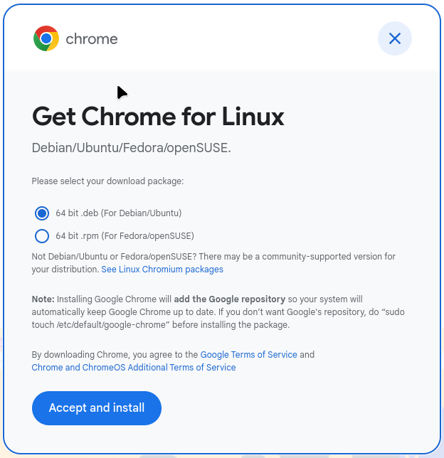
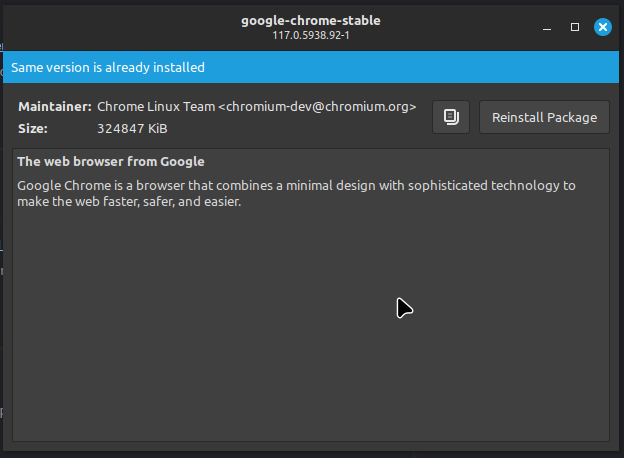
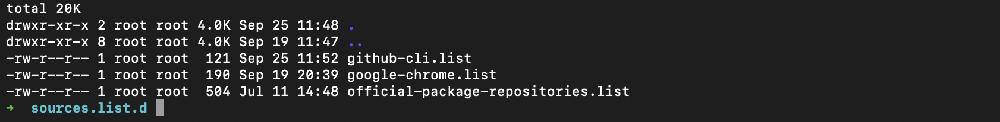

# Global Applications

**NOTE:** This is a good example of how some applications can be installed using `.deb` packages from various sources. 

## SSHD

If one wants to connect to the box remotely, openssh-server is not installed by default. 

```shell
sudo apt install openssh-server molly-guard monkeysphere ssh-askpass monkeysphere-validation-agent
```

**NOTE:** Key pairs we will configure later.

## GitHub CLI Client

NOTE: Package `GH` exists in Ubuntu repository, however, it's outdated. <br/>
Use [these instructions to install the current version](https://github.com/cli/cli/blob/trunk/docs/install_linux.md) from GitHub package repository.

Here is the snippet from the instructions:

```shell
type -p curl >/dev/null || (sudo apt update && sudo apt install curl -y)
curl -fsSL https://cli.github.com/packages/githubcli-archive-keyring.gpg | sudo dd of=/usr/share/keyrings/githubcli-archive-keyring.gpg \
&& sudo chmod go+r /usr/share/keyrings/githubcli-archive-keyring.gpg \
&& echo "deb [arch=$(dpkg --print-architecture) signed-by=/usr/share/keyrings/githubcli-archive-keyring.gpg] https://cli.github.com/packages stable main" | sudo tee /etc/apt/sources.list.d/github-cli.list > /dev/null \
&& sudo apt update \
&& sudo apt install gh -y
```

This will add a source manifest in `/etc/apt/sources.list.d/github-cli.list`

```
deb [arch=amd64 signed-by=/usr/share/keyrings/githubcli-archive-keyring.gpg] https://cli.github.com/packages stable main
```

## Google Chrome Browser

Navigate to https://www.google.com/chrome/ and download your DEB package. Double-click in Downloads to install using graphical package manager that will open automatically.



NOTE: This image shows that package already installed is tracked natively.



Chrome installer will add its own sources manifest. By now we have three:



Contents of `/etc/apt/sources.list.d/google-chrome.list`

```
### THIS FILE IS AUTOMATICALLY CONFIGURED ###
# You may comment out this entry, but any other modifications may be lost.
deb [arch=amd64] https://dl.google.com/linux/chrome/deb/ stable main
```

## Discord

Most hackers use Discord to communicate over their projects.
The installation is similar to that of Google Chrome, but no PPT repository is added to the source list daemon.

Download Discord package here: https://discord.com/

Direct link: https://dl.discordapp.net/apps/linux/0.0.30/discord-0.0.30.deb


